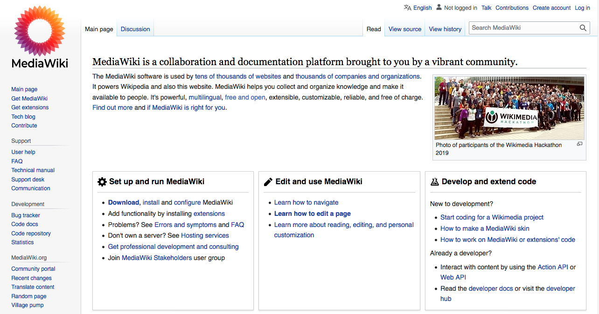

<!--
Este archivo README esta generado automaticamente<https://github.com/YunoHost/apps/tree/master/tools/readme_generator>
No se debe editar a mano.
-->

# MediaWiki para Yunohost

[](https://ci-apps.yunohost.org/ci/apps/mediawiki/)


[](https://install-app.yunohost.org/?app=mediawiki)

*[Leer este README en otros idiomas.](./ALL_README.md)*

> *Este paquete le permite instalarMediaWiki rapidamente y simplement en un servidor YunoHost.*  
> *Si no tiene YunoHost, visita [the guide](https://yunohost.org/install) para aprender como instalarla.*

## Descripción general

MediaWiki is a free and open-source wiki software package written in PHP. It serves as the platform for Wikipedia and the other Wikimedia projects, used by hundreds of millions of people each month. MediaWiki is localised in over 350 languages and its reliability and robust feature set have earned it a large and vibrant community of third-party users and developers.


**Versión actual:** 1.43.0~ynh1

**Demo:** <https://www.wikipedia.org>

## Capturas



## Documentaciones y recursos

- Sitio web oficial: <https://www.mediawiki.org>
- Documentación usuario oficial: <https://www.mediawiki.org/wiki/Project:Help>
- Documentación administrador oficial: <https://www.mediawiki.org/wiki/Documentation>
- Repositorio del código fuente oficial de la aplicación : <https://github.com/wikimedia/mediawiki>
- Catálogo YunoHost: <https://apps.yunohost.org/app/mediawiki>
- Reportar un error: <https://github.com/YunoHost-Apps/mediawiki_ynh/issues>

## Información para desarrolladores

Por favor enviar sus correcciones a la [rama `testing`](https://github.com/YunoHost-Apps/mediawiki_ynh/tree/testing).

Para probar la rama `testing`, sigue asÍ:

```bash
sudo yunohost app install https://github.com/YunoHost-Apps/mediawiki_ynh/tree/testing --debug
o
sudo yunohost app upgrade mediawiki -u https://github.com/YunoHost-Apps/mediawiki_ynh/tree/testing --debug
```

**Mas informaciones sobre el empaquetado de aplicaciones:** <https://yunohost.org/packaging_apps>
